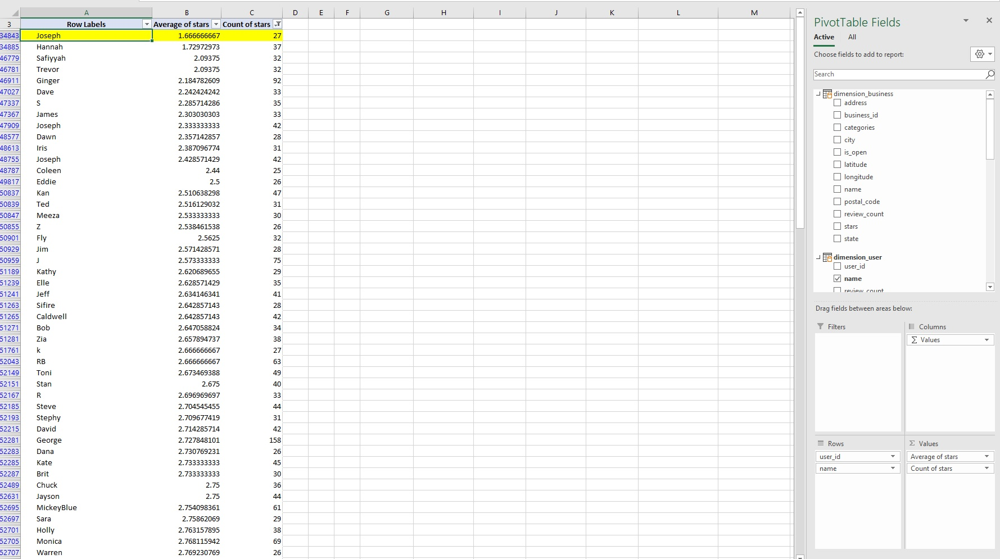
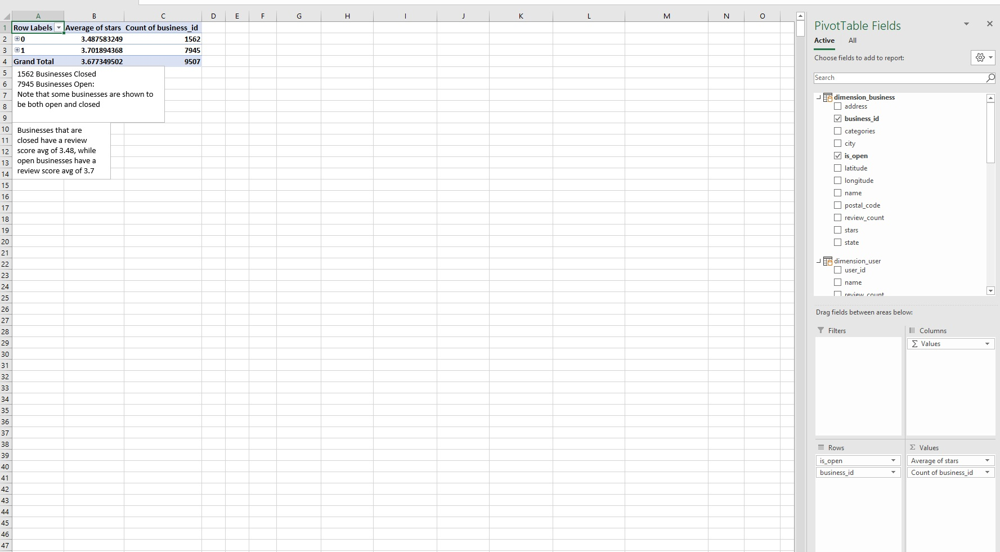
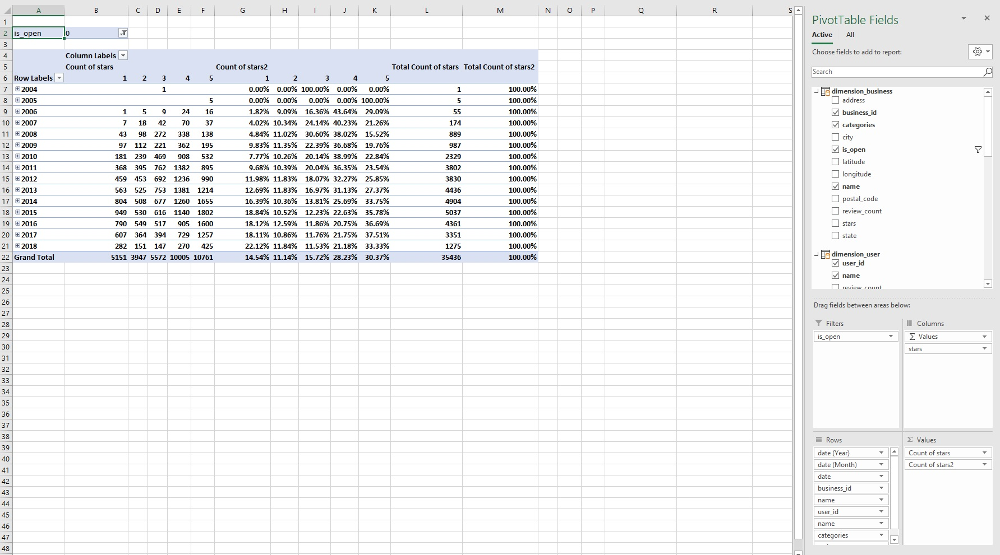

# yelp-search-project

# Introduction
For this project, I was assigned with exploring Yelp reviews of businesses in Charlotte, NC and report any interesting findings. The primary way used to explore the data was through the use of Pivot Tables and PowerPivot. For this project I used Excel.

Data sources: All data for this project was provided by NSS

# Table of Contents
* [Introduction](#Introduction)
* [Excel Walkthrough](#Excel-Walkthrough)

# Excel Walkthrough
1. The data for this project consisted of four tables with roughly two million rows of data total. Due to the personal nature of the datasets, I am only able to show aggregated data.

2. For the first pivot table, I wanted to see what reviewer had the lowest average review score. I used the `stars` column and found the average of stars and count of stars for the values. As for the rows, I used the `user_id` and `name` columns to show which reviewer has the lowest average review score, and it is Joseph with 1.66 stars.

3. For the second pivot table, I wanted to see what businesses were open compared to those who have closed in the dataset and see if there was any correlation between review score and whether a business had closed down. I used the average of the `stars` column and a count of the `business_id` column for the values. For the rows, I used the `is_open` column and the `business_id` column to show what businesses are still open compared to those who are closed. In the original dataset, there was a note that `0` represented a closed business, while `1` represented a business that was still open.

4. For the final pivot table I wanted to take a look at reviews year to year. I experimented with this pivot table by filtering the table by the `is_open` column, so we can compare open to closed businesses and star rating year to year. The values used for this table included a percentage of total star ratings and a count of total star ratings. The rows used on the pivot table included the `date`, `business_id`, `business_name`, `user_id`, `user_name`, `categories`, and `review_text` columns. This way, I can drill down and see what reviewers say for each business by year, month, and day. There is an increase in reviews as the years progress. This falls in line with the rapid growth of Yelp and the internet during the late 2000s and early 2010s.

